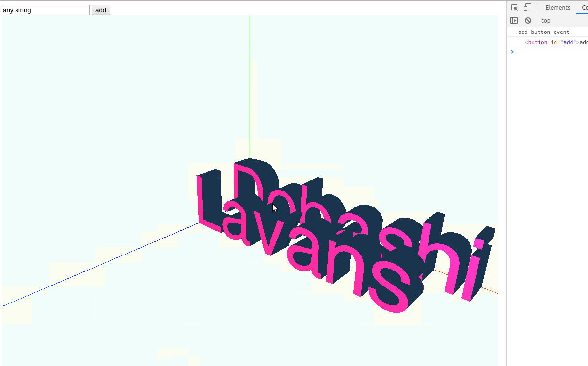

tjs
----

## About

Easy Three.js wrapper



You can move 3D objects with OrbitControl

## How to use

```
import { Vector3 } from 'three';
import { stage } from './Stage';

window.addEventListener('load', async () => {
    document.body.appendChild(stage.renderer.domElement)
    stage.animate()

    stage.addText('<YOUR TEXT>', new Vector3(0, 0, 1), 0)
})

```

see main.js as sample

## TODO

- online sample site
- refine init method
- refactor as library and move main.ts to sample

